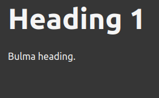

# Mkdocs Bulma Classes Plugin

Add support to [Bulma CSS framework](https://bulma.io) in [Mkdocs](https://www.mkdocs.org).

Inspired by [mkdocs-bootstrap-tables-plugin](https://github.com/byrnereese/mkdocs-bootstrap-tables-plugin/blob/master/mkdocs_bootstrap_tables_plugin/plugin.py).

This plugin inject first in the Markdown of the page and then in the raw html elements produced by Mkdocs from Markdown all necessary classes for styling with Bulma framework. I'll try to follow in the most pedantic way the last [CommonMark](https://commonmark.org/) specification released before supporting other versions.

In this doc you will find all supported Markdown tags, organized by corresponding Bulma style rule. This because when I want to design my doc I want to do it for my customers, not for me. My customers look at my HTML doc more frequently than the raw md doc so it's better for me look at the Bulma style class more useful for the content I want to give in my doc. For example: if I want to give the feeling of a title with a subtitle, I write this code:

    # Title

    ## Subtitle

But what this look is:

When I was looking for this instead:

So I have to write this code to get the looks I want:

    Title
    ===

    Subtitle
    ---

To get this result in the smallest click by click on my doc I've decided to use this path: from Bulma style I want to get to the Markdown I want to write.

## About

In this guide I'll cover next to nothing about the use of Bulma, since there is a beatiful documentation on their site. I'm focusing on the mapping from Bulma classes to Markdown tags you need to use in your documents to reach the most resembling result.

## See also

Take a look at my [Bulma Theme](https://github.com/daniele-tentoni/mkdocs-bulma-theme) for Mkdocs.
